# Level 2 — Model Comparison and Analysis  
**Contributor:** adiavolo  
**Models:** Linear Regression (Gradient Descent) & Perceptron  
**Datasets:** `binary_classification.csv`, `binary_classification_non_lin.csv`  

---

## 🧩 1. Dataset Overview

| Dataset | Samples | Class Balance | Observations |
|----------|----------|---------------|---------------|
| binary_classification | 600 | class0 = 288, class1 = 312 | Nearly linearly separable with mild overlap and noise |
| binary_classification_non_lin | 800 | class0 = 399, class1 = 401 | Non-linear separation with intertwined clusters |

### Visuals
The two datasets below form the basis for comparing linear and non-linear performance:

| Linear Dataset | Non-Linear Dataset |
|----------------|--------------------|
| 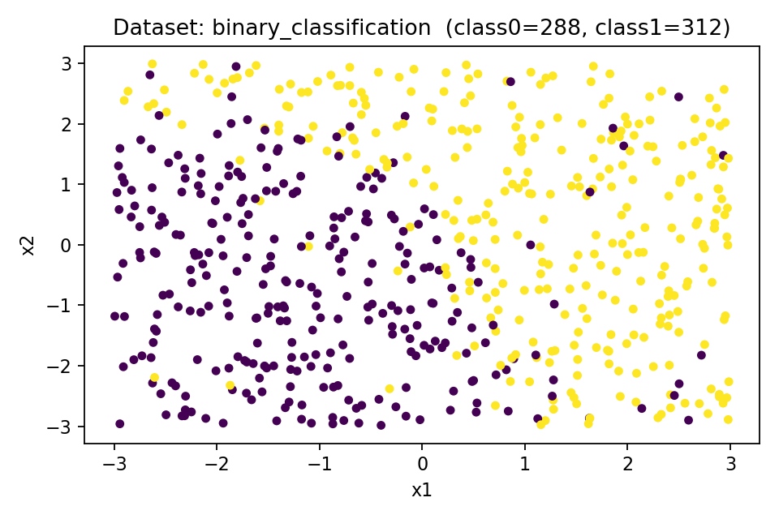 | 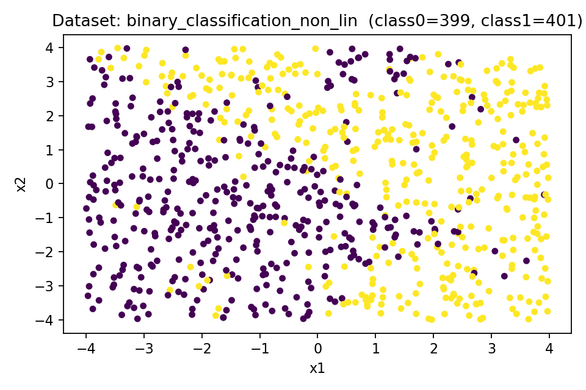 |

**Interpretation**
- The first dataset shows a clear diagonal separation — ideal for linear classifiers.  
- The second introduces curved, overlapping regions — testing the models’ limits.  
- Both are balanced, ensuring unbiased accuracy evaluation.

---

## ⚙️ 2. Decision Boundary Analysis

Each model’s learned boundary reveals how it interprets data structure.

| Model | Linear Dataset | Non-Linear Dataset |
|--------|----------------|--------------------|
| **Linear Regression** | 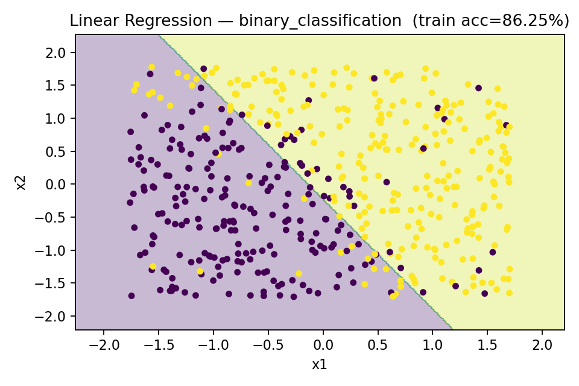 | 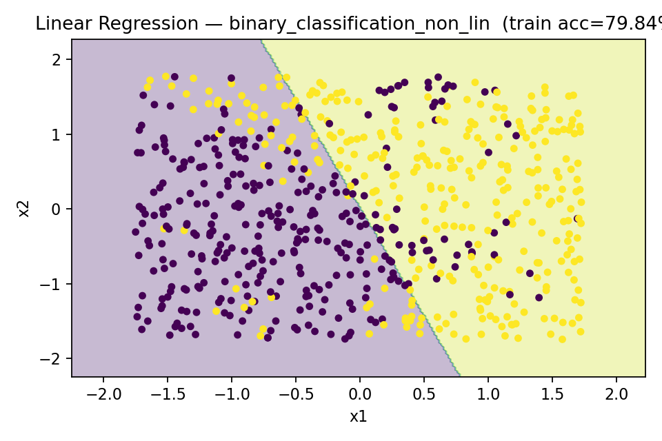 |
| **Perceptron** | 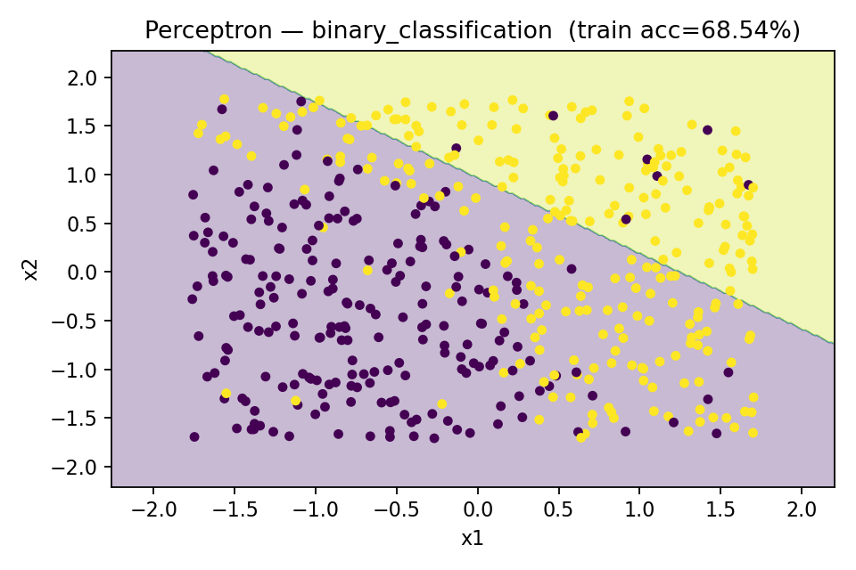 | 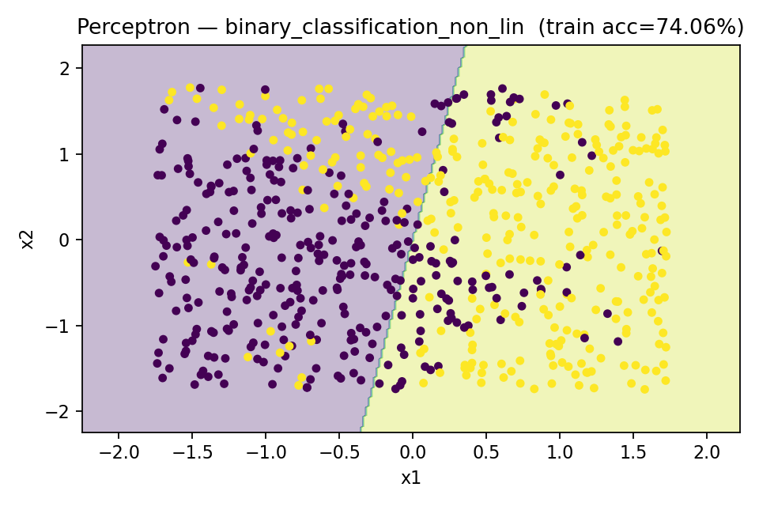 |

### Observations

**Linear Regression — binary_classification**
- Produces a clean, diagonal boundary with minor edge misclassifications.  
- Achieves ~86% training accuracy, converging within 30 iterations.  
- Handles small overlaps effectively through continuous loss minimization.

**Linear Regression — binary_classification_non_lin**
- The line cuts across a curved separation, resulting in more misclassifications.  
- Still achieves ~79% accuracy due to its ability to find an averaged best-fit plane.  
- Reflects model bias rather than poor optimization.

**Perceptron — binary_classification**
- Boundary direction similar to regression but slightly misaligned.  
- Accuracy drops to ~68%, showing instability under non-separable noise.  
- Fails to converge, oscillating between suboptimal weights.

**Perceptron — binary_classification_non_lin**
- Approximates a straight divider through curved data (~74% accuracy).  
- Required ~2000 iterations with no convergence improvement.  
- Illustrates inefficiency of discrete updates versus gradient descent.

**Conclusion:**  
Linear Regression yields **smoother, more stable boundaries**, while Perceptron results in **noisy, unstable separation** when perfect separability is absent.

---

## 📉 3. Convergence Behavior

Convergence curves provide a direct look at model learning dynamics.

| Model | Linear Dataset | Non-Linear Dataset |
|--------|----------------|--------------------|
| **Linear Regression — Loss Curve** | 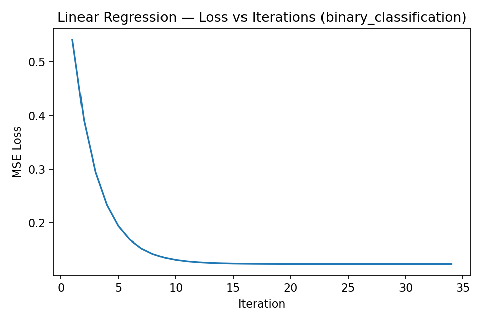 | 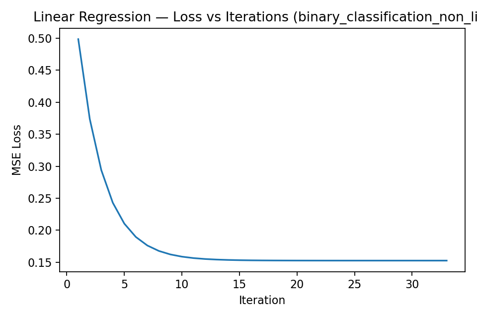 |
| **Perceptron — Mistakes Curve** | 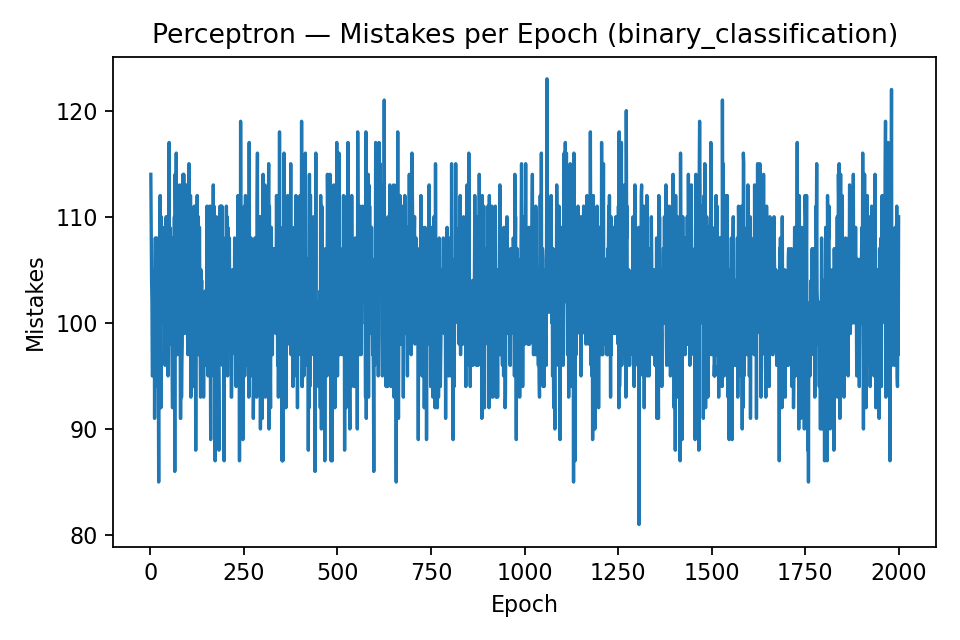 | 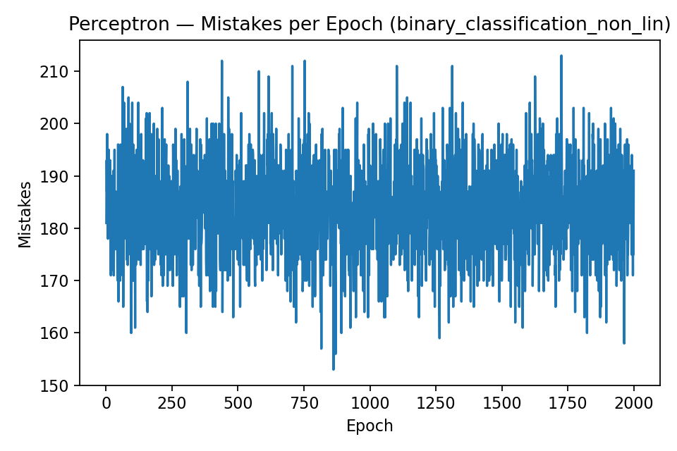 |

### Insights

**Linear Regression**
- Loss decreases sharply in early iterations and stabilizes smoothly — classic convex convergence.  
- Converges around iteration 30 for both datasets.  
- Slightly higher final loss on the non-linear dataset reflects underfitting, not instability.

**Perceptron**
- Mistake counts fluctuate heavily between epochs, with no visible downward trend.  
- Confirms non-convergence and oscillatory weight adjustments.  
- Higher mistake range (150–210) in non-linear data indicates complete failure to stabilize.

**Summary:**  
Linear Regression demonstrates **stable gradient-based convergence**, while Perceptron exhibits **chaotic, mistake-driven non-convergence**.

---

## 📊 4. Performance Comparison

### Accuracy Summary

| Dataset | Linear Regression | Perceptron | Converged | Time to Train | Accuracy Gap |
|----------|------------------|-------------|-------------|----------------|----------------|
| binary_classification | 0.900 | 0.733 | ✅ / ❌ | 0.024s / 1.34s | +17% |
| binary_classification_non_lin | 0.762 | 0.750 | ✅ / ❌ | 0.033s / 1.85s | +1% |

### Visual Comparison

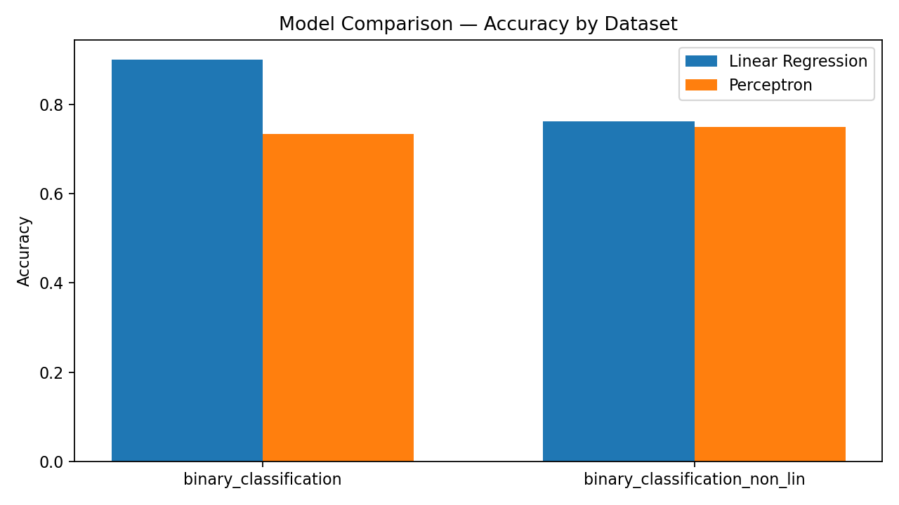

**Interpretation**
- Linear Regression outperforms Perceptron on both datasets, particularly on the linear one (+17% gap).  
- On non-linear data, both models plateau at ~75%, confirming the limit of linear expressiveness.  
- Regression achieves convergence rapidly with lower training cost, while Perceptron wastes epochs re-adjusting.

---

## 🧠 5. Overall Summary

| Aspect | Linear Regression | Perceptron |
|---------|-------------------|-------------|
| Optimization | Continuous (Gradient Descent) | Discrete (Error Correction) |
| Convergence | Fast & Guaranteed (Convex Loss) | Only if Data is Perfectly Separable |
| Noise Tolerance | High | Low |
| Computation | Efficient (~30 iters) | Slow (~2000 epochs) |
| Stability | Smooth convergence | Oscillatory, unstable |
| Accuracy (Linear) | ~90% | ~73% |
| Accuracy (Non-Linear) | ~76% | ~75% |

---

## 🔍 6. Key Takeaways

1. **Linear Regression** learns a balanced boundary through continuous error minimization, making it robust to overlap and noise.  
2. **Perceptron** struggles on real-world data due to its binary update logic and lack of convergence guarantee.  
3. Both models hit their performance ceiling on non-linear data, motivating feature expansion or kernel-based approaches.  
4. These experiments visually and quantitatively confirm the **difference between smooth optimization and discrete correction** — the foundation of why gradient-based methods dominate modern ML.

---

## 🌱 7. Reflection

Potential next steps to extend this work:
- Add **polynomial feature expansion** to capture non-linear trends.  
- Implement **Logistic Regression** for probabilistic classification.  
- Explore **kernel tricks or neural networks** to overcome linear limitations.  

---

**References:**  
- GitHub Copilot (for initial scaffolding)  
- ChatGPT (for explanation refinement and documentation clarity)

---
